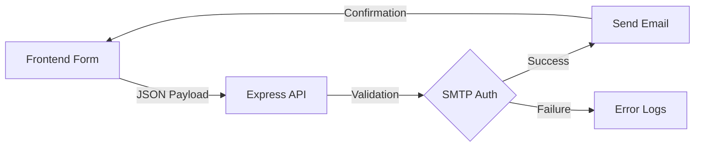

# 🛡️ Advanced Cybersecurity Portfolio (Hacker OS Edition)

A high-performance, interactive cybersecurity-themed portfolio designed to mimic a sophisticated "Hacker OS". Featuring a live interactive terminal, real-time data visualizations, and a secure Node.js backend.

## 🚀 Live Demo Features

- **Interactive Terminal**: Custom shell with commands like `whoami`, `skills`, `hack_me` (CTF mode), and `clear`.
- **System Dashboard**: Radar charts for tech-stack visualization and activity heatmaps.
- **Hacker Aesthetic**: CRT scanline effects, binary rain, digital grids, and neon-green glow.
- **Secure Backend**: Node.js/Express server handling contact form transmissions via SMTP with automated error handling.
- **OS-Style UI**: Modular window containers for "About" and "Terminal Lab" sections.

## 📂 Project Structure

```text
portfolio/
├── backend/                # Node.js Express Server
│   ├── index.js           # Server logic & SMTP configuration
│   ├── .env               # Private credentials (ignored by git)
│   └── package.json       # Backend dependencies
├── src/                    # React Frontend (Vite + TS)
│   ├── components/        # Modular UI Components
│   │   ├── TerminalLab.tsx # Terminal & Data Visuals
│   │   ├── Hero.tsx        # Binary Rain & Intro
│   │   ├── WindowContainer.tsx # Frame logic
│   │   └── BackgroundEffects.tsx # CRT/Grid/Laser effects
│   ├── App.tsx            # Main Application logic
│   └── index.css          # Tailwind & Global Styles
├── .gitignore             # Security filters for credentials
└── package.json           # Frontend dependencies
```

## ⚙️ Backend Workflow

The backend acts as a secure bridge between the frontend and the email system.



1. **User Action**: A visitor fills out the contact form.
2. **Transmission**: Data is sent via `POST` to `/api/contact`.
3. **Authentication**: The server authenticates using a Google App Password stored in `.env`.
4. **Execution**: Nodemailer generates a professional HTML-formatted email.
5. **Response**: Frontend displays a "TRANSMISSION_SUCCESS" notification.

## 🛠️ Installation & Setup

### 1. Clone the Repository
```bash
git clone <your-repo-url>
cd Portfolio_
```

### 2. Frontend Setup
```bash
npm install
npm run dev
```

### 3. Backend Setup
1. Navigate to the backend folder:
   ```bash
   cd backend
   npm install
   ```
2. Create a `.env` file in the `backend/` directory:
   ```env
   EMAIL_USER=your-email@gmail.com
   EMAIL_PASS=your-16-character-app-password
   RECEIVER_EMAIL=your-email@gmail.com
   PORT=5000
   ```
3. Start the server:
   ```bash
   node index.js
   ```

## 🔒 Security Note
This project is configured with a strict `.gitignore` to ensure your **App Passwords** and **SMTP credentials** are never pushed to public repositories. Always use environment variables for sensitive data.

---
**Crafted by Divyanshu Shinde**  
*Cybersecurity Specialist | CTO at Incubator Pool*

---
📸 **Instagram**: [Divyanshu_Shinde.35](https://www.instagram.com/divyanshu_shinde.35/)  
🔗 **LinkedIn**: [Divyanshu Shinde](https://linkedin.com/in/divyanshu-shinde-15325b2b1/)

